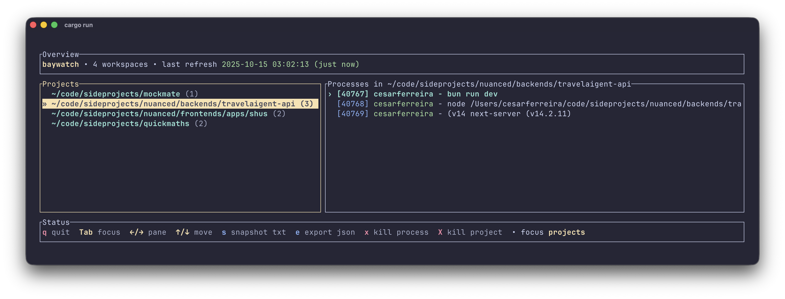

# baywatch

`baywatch` is a Rust TUI that groups your running processes by working directory so you can immediately see which projects are busy, what tools are active, and terminate runaway jobs without hunting for PIDs.




## Features

- Live, colored dashboard that refreshes every two seconds.
- Projects pane on the left; process list on the right with contextual highlighting.
- Skip OS noise: filters out `/System`, `/Applications`, `~/Library`, and common shell wrappers.
- Instant snapshots (`s`) and JSON exports (`e`) with timestamped filenames.
- One‑key termination for a single process (`x`) or every process in a project (`X`).
- Keyboard shortcuts inspired by Vim and htop for quick navigation.

## Installation

```bash
cargo install --path .
```

or add the repository as a dependency:

```bash
cargo install --git https://github.com/cesarferreira/baywatch.git
```

> Requires Rust 1.76+ (edition 2024) and the `ps`/`lsof` utilities available on your system.

## Usage

Run the TUI (default):

```bash
cargo run
```

Generate a single snapshot without the TUI:

```bash
cargo run -- snapshot
```

Export the current snapshot to JSON:

```bash
cargo run -- export baywatch.json
```

### Keyboard Shortcuts

| Key            | Action                                |
| -------------- | ------------------------------------- |
| `q`, `Esc`     | Quit                                  |
| `Tab`          | Toggle focus between panes            |
| `←` / `h`      | Focus projects pane                   |
| `→` / `l`      | Focus processes pane                  |
| `↑` / `k`      | Move selection up                     |
| `↓` / `j`      | Move selection down                   |
| `r`            | Manual refresh                        |
| `s`            | Write text snapshot (`baywatch-*.txt`)|
| `e`            | Export JSON snapshot (`baywatch-*.json`)|
| `x`            | Kill selected process (SIGTERM)       |
| `X`            | Kill all processes in selected project |

Status messages along the bottom show the active pane, shortcut hints, and the outcome of recent actions.

## How It Works

1. `ps -axo pid,user,comm,args` captures the current-user processes.
2. `lsof -Fn -a -d cwd -p <pids>` resolves working directories in small batches.
3. Processes are filtered and grouped; the TUI renders two scrollable lists with `ratatui` and handles input via `crossterm`.
4. The killer shortcuts send `SIGTERM` through `libc::kill`.
5. Snapshots go to STDOUT (or files) using human-readable paths and command lines.

## Development

```bash
cargo fmt
cargo clippy --all-targets --all-features
cargo test
```

> The live TUI uses raw terminal mode; if it crashes, run `reset` to restore your terminal.

## License

MIT © Cesar Ferreira (update as needed)
